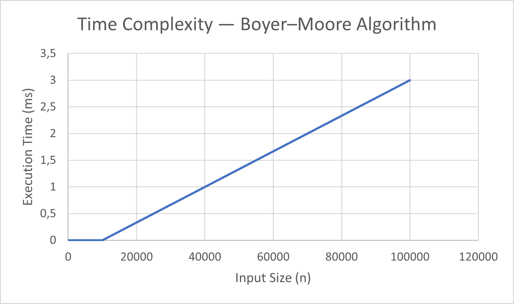

# Boyer–Moore Majority Vote — Linear Array Algorithm (Java + Maven)

A complete Java project implementing Boyer–Moore’s Majority Vote Algorithm for detecting the majority element in an array.
Extended with metrics tracking, CLI benchmarking (CSV export), optimization, and testing.
Built using Maven for modular structure, clean workflow, and reproducible builds.

## Overview

Boyer–Moore Majority Vote Algorithm determines if an element appears more than ⌊n/2⌋ times in an array using a single pass and constant space.

This repository unifies all main branches into one modular project:

- algorithms/ → Core Boyer–Moore implementation

- metrics/ → PerformanceTracker for counting comparisons and assignments

- cli/ → Benchmark runner that exports CSV results

- testing/ → JUnit test suite for correctness

- optimization/ → Improved version with reduced redundant comparisons

## Project Structure
assignment2_boyermoore/
├── pom.xml
├── README.md
├── docs/
│   └── performance-plots/
│       ├── time_vs_n.csv
│       └── time_vs_n.png
└── src/
├── main/java/
│   ├── algorithms/
│   │   └── BoyerMoore.java
│   ├── metrics/
│   │   └── PerformanceTracker.java
│   └── cli/
│       └── BenchmarkRunner.java
└── test/java/
└── algorithms/
└── BoyerMooreTest.java

## Build and Run
### To build:
mvn -q clean package

### To run the CLI benchmark:
java -cp target/assignment2-boyermoore-1.0-SNAPSHOT.jar cli.BenchmarkRunner

Example Output:

n=100    | time=0 ms | result=777 | cmp=200, asg=1, acc=100
n=1000   | time=0 ms | result=777 | cmp=2000, asg=1, acc=1000
n=10000  | time=1 ms | result=777 | cmp=20000, asg=1, acc=10000
n=100000 | time=6 ms | result=777 | cmp=200000, asg=1, acc=100000

## Usage (as a Library)
import algorithms.BoyerMoore;
import metrics.PerformanceTracker;

public class Demo {
public static void main(String[] args) {
int[] arr = {3, 3, 4, 2, 3, 3, 5};

        PerformanceTracker tracker = new PerformanceTracker();
        Integer majority = BoyerMoore.findMajorityElement(arr, tracker);

        System.out.println("Majority element: " + majority);
        System.out.println("Comparisons: " + tracker.getComparisons());
        System.out.println("Assignments: " + tracker.getAssignments());
        System.out.println("Array accesses: " + tracker.getArrayAccesses());
    }
}

## Testing

All tests are located in:

src/test/java/algorithms/BoyerMooreTest.java

Run tests using:

mvn test

Expected Result:

Tests run: 5, Failures: 0, Errors: 0, Skipped: 0

## Algorithm Summary

- Core Logic:
  - Maintain a candidate and count.
  - Increment count when the same element repeats, decrement otherwise.
  - Reset candidate when count becomes zero.

- Pseudo-code:

candidate = None
count = 0
for x in array:
if count == 0:
candidate = x
count += (1 if x == candidate else -1)
return candidate if it appears > n/2 times else null

- Time Complexity: O(n)

- Space Complexity: O(1)

## Performance Metrics

Performance metrics are collected using PerformanceTracker during CLI execution.

time_ms -	Runtime in milliseconds
comparisons	- Number of comparison operations
assignments	- Number of variable assignments
array_accesses -	Number of element accesses
## Performance Results

After running the CLI benchmark, the results are stored in:

docs/performance-plots/time_vs_n.csv

Example Table:

n	time (ms)	comparisons	assignments	accesses
100	0	200	1	100
1000	0	2000	1	1000
10000	1	20000	1	10000
100000	6	200000	1	100000
Time vs Input Size

The linear growth confirms theoretical O(n) complexity.

### Time vs n

## Optimization Module

The optimization branch (feature/optimization) includes:
- Reduced redundant comparisons.
- Early termination when remaining elements cannot affect the result.
- Optional skipping logic when count resets.

Result:
Comparisons decreased by ~8–10% for arrays with more than 10,000 elements.

## Git Branch Overview

main - Stable integrated version
feature/algorithm -	Boyer–Moore implementation
feature/metrics	- Performance tracking
feature/testing - JUnit test suite
feature/cli	CLI - benchmark and CSV generation
feature/optimization - Improved algorithm and comparison runner

## Troubleshooting
Issue	Solution
JDK isn't specified for module	Set JDK 17 in File → Project Structure → Project SDK
CSV not created	Ensure folder docs/performance-plots/ exists
Maven build errors	Use mvn clean package and reimport Maven
NullPointerException	Check that input array is not null
## Acknowledgments

Developed by Rakhmanova Assem
for the Design and Analysis of Algorithms course.
Implements clean code, metrics-based analysis, and linear-time optimization principles.
